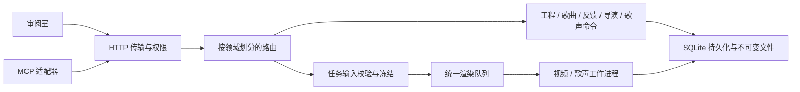

# 当前工程架构

本文描述当前代码及维护入口。计划、认领、验证进度和未支持能力统一放在 [ROADMAP.md](../ROADMAP.md)。VideoGraph 是可信本机用户的单机工作台；一个服务进程对应一套工程根目录和令牌，不是远端多租户平台。

## 请求与任务

| 位置 | 职责 |
|---|---|
| `src/server/index.mjs` | 可执行入口：启动服务、注册进程退出信号 |
| `src/server/service.mjs` | 组装依赖，取得端口后发布凭证/恢复任务，启动与关闭分析器、队列、预览和HTTP |
| `src/server/service-config.mjs` | 集中校验端口、本地来源、任务停滞预算和令牌位置 |
| `src/server/http-app.mjs` / `http.mjs` / `auth.mjs` | HTTP、CORS、凭证身份、上传边界和错误响应；不实现业务命令 |
| `src/server/project-router.mjs` / `routes/` | 稳定HTTP入口与功能适配；歌曲、歌声、导演、镜头、转场、任务和媒体各自维护 |
| `src/server/render-jobs.mjs` | 参数、导出闸门和时间窗校验，冻结任务输入，持久化并入队，公开任务表示与等待 |
| `src/server/preview-project.mjs` / `preview-pool.mjs` | 当前/修改前版本的预览准备、播放器范围和实例复用 |
| `src/server/project-store.mjs` / `song-project.mjs` / `feedback.mjs` / `director.mjs` / `vocal-project.mjs` | 领域命令、输入修订和人工采用规则；project-store保留现有兼容导出 |
| `src/server/project-repository.mjs` / `project-generation.mjs` / `project-backup.mjs` | SQLite、任务/历史、完整分析版本发布、备份与恢复 |
| `src/server/render-queue.mjs` / `render-worker.mjs` / `vocal-worker.mjs` | 调度、取消、停滞治理；工作进程执行冻结输入，产物校验后发布 |
| `src/song/` / `src/vocal/` / `src/fx/` | 分析契约/适配、歌声工具与渲染、特效参数/运行时；不依赖工程服务 |
| `src/server/mcp-*.ts` / `src/pdoom/mcp-server.ts` | MCP工具与注册；人工权限仍由服务判定 |

导入 `service.mjs` 不启动监听或后台任务。`createProjectService(config)` 返回 `start()`、`close()` 和HTTP server，便于独立生命周期验收。启动失败关闭已获取的资源；端口冲突不能覆盖现有令牌。不要在同一进程内通过变更 `process.env` 切换工程根目录：持久化模块在加载时确定根目录，多实例使用独立进程及目录。

HTTP路径、响应、MCP名称和修订规则沿用现有契约。路由使用公共 `body()` 读取变更请求，凭证决定author，不能从请求体取得人工权限。领域层负责版本、业务状态和采用约束；路由不能代替领域校验。媒体和health的现有读取策略保留，UI 与 MCP 使用不同凭据；人工采用、拒绝、回复及解锁受凭据身份控制。原生进程可以伪造 Origin 或读取本机文件，因此此认证不是同一 OS 用户下的恶意进程隔离。历史修复见 [审查归档](archive/2026-10-06-quality-review.md)。

## 前端

| 位置 | 职责 |
|---|---|
| `src/project/contracts.ts` | 传输及视图类型；不包含浏览器行为或服务调用 |
| `src/project/api.ts` | 本地会话、HTTP传输、错误解析、文件URL；兼容再导出既有类型 |
| `src/project/useProjectSession.ts` | 工程列表/切换、版本受保护的轮询、任务和导演状态；保留过时响应防护 |
| `src/project/usePreviewClock.ts` | iframe播放头及状态重置；同时校验消息origin和iframe source |
| `src/project/ProjectStudio.tsx` | 页面编排、选中目标、用户操作与编辑草稿的生命周期 |
| `JobPanel.tsx` / `ShotSourceDialog.tsx` / 其他功能面板 | 任务展示、源码编辑界面及各功能区；采用/写入通过父级动作和服务执行 |

选中目标、未保存草稿、工程修订和任务冻结版本是不同状态，不互相替代。拆组件时要保留工程/输入令牌判断、消息来源校验、导演读取失败时的保守导出闸门，以及人对比采用的流程。

## 可执行维护约束

`npm run check:architecture` 使用现有TypeScript解析器检查src的静态导入、再导出和字面量动态导入。它拒绝运行时循环、找不到的本地模块、浏览器引入Node/后端、引擎能力反向依赖服务、持久化层依赖功能适配器，以及其他模块导入可执行入口。纯类型引用不当作运行时循环；计算得到的动态路径不在静态证明范围内。

`tsconfig.server.json` 对带顶部 `@ts-check` 的基础层执行严格JSDoc类型检查：配置、HTTP、权限、错误、服务生命周期、队列、文件哈希、分析版本和硬切采样。既有领域/渲染JavaScript尚未全部严格检查；不要把这一入口称为后端全量类型覆盖。前端及MCP TypeScript沿用现有strict检查。

歌声模块内部由 `expressions.mjs` 统一曲线单位与跨音符音高模型，`phoneme-layout.mjs` 计算相邻音素时序/包络，`pitch-analysis.mjs` 独立实测音频及生成诊断。`render.mjs` 负责缓存/外部重采样/拼接，`mix.mjs` 提供混音参数与 DSP，工程 worker 执行冻结混音并发布候选。表达模型不依赖文件或工程服务，实测报告不把乐谱推算冒充音频测量。

资源、数据库和迁移边界见 [PROJECT-STORAGE.md](PROJECT-STORAGE.md)，歌声能力/外部工具契约见 [VOCAL.md](VOCAL.md)。场景运行检查不等于场景源码类型检查；当前检查也不提供针对恶意场景的操作系统级沙箱。

## 0.2 大工程执行边界

HTTP 主线程处理认证、流式媒体、轻量 health 和调度；目录哈希、数据库大行、领域命令、源码检查/草稿和诊断通过 operation-catalog 的静态白名单交给 OperationPool（两个常驻 worker_threads、128项队列、超时/退出更换，不重放失败的变更）。视频/歌声使用独立子进程；Python 由主服务管理生命周期。预览 Vite 实例独立池化，准备文件在工作线程完成。关闭先拒绝新请求，任务空闲确认与关闭之间保持入站暂停，避免刚检查完又入队。

record-objects/job-records 负责内容引用格式；project-repository 保留修订事务；storage-maintenance/retention 负责迁移和受引用保护的保留。shared scene 是工程级 registry，镜头绑定模块ID/版本/参数；一次发布检查全部目标、意见、锁和导演租约，只产生一个修订。单镜改写显式脱离共享模块。scene-drafts 是临时代码覆盖，不写正式源码/任务/历史；快速检查说明动态创建材料的覆盖限制。

engine-assets 核验随包引擎清单，新歌无需外部参考库；scene-library 提供可检索的类型化相机/投影/世界卡片、参数环境、逐字动画和独立图层。外部真值经 external-analysis 校验实际媒体、记录中性占位来源后发布；分析质量标记不能在契约归一化中丢失，过半估算歌词禁止确认。MIDI/假名解析在 src/vocal，外部音频冻结导入在 vocal-project，worker 生成候选和实测 F0/频段报告；人工采用语义保持独立。

scripts/workbench 是 Windows 完整工作台的启动/配置/所属实例管理入口，平台 process-lease 用 SQLite 事务原子登记 PID/token 并回收已退出的归属，永不按端口杀进程。scripts/package-windows 是许可资源白名单打包器，构建目录与最终清单双重排除音源/用户数据。
