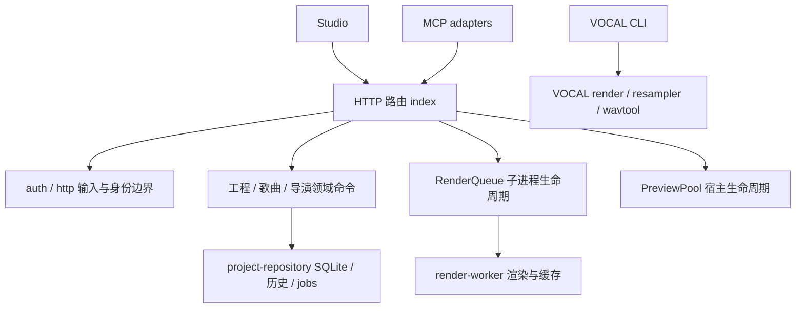

> 历史归档。原文件：`docs/QUALITY-REVIEW.md`；归档于 2026-10-07。本文的版本、进程、任务状态和待办只反映原记录时间，当前事实及未完成事项以 [当前计划](../../ROADMAP.md) 为准。

# 代码审查与工程化加固（2026-10-06）

本次审查基于 `7689b21`，阅读 HANDOFF、STAB-01 交接、ROADMAP、VOCAL 文档，并核对最近的稳定化和 VOCAL-M1/M2 提交。改动保留在工作区，尚未提交。工作区原有的 `scripts/tmp-verify-fx-detail.mjs` 未改动。

## 对上一轮工作的判断

已经形成可用的领域基础：不可变镜头源码、版本令牌、反馈响应绑定、独立渲染进程、镜头级缓存、可操作的 MCP 契约与相当数量的真实媒体测试。前端懒加载和上下文复用有效，构建主包约 299KB。VOCAL 已有独立目录、CLI 和离线桩工具测试。

但 STAB-01 的“尚未提交”描述已经过时，部分未完成项仍真实存在。原有测试通过不能证明 HTTP 权限正确，也没有覆盖重采样器同路径升级、遗留输出和损坏缓存。FB-04 曾经失败的 JSON 解析问题本次成功复现，不能作为已完成验收引用。VOCAL 仍是单 part、常速、别名直查与简化重叠布局，不能当作完整 OpenUtau 歌唱实现。

## 本次修复与结构调整

| 问题 | 处理与验证要点 |
|---|---|
| UI/MCP 共用令牌，请求体可以自标 human | 拆分令牌，HTTP 身份由凭据确定；MCP 凭据不能采用/拒绝意见、接受审片、人工回复或修改锁。HTTP 回归直接伪造 author 验证 403 |
| 重复工程 409 的详情在 HTTP 层丢失；allowDuplicate 被忽略 | 保留 ProjectError.details，并将 allowDuplicate 显式传入建工程命令 |
| 任务退出回调的数据库异常阻塞整个队列 | RenderQueue 负责派发、取消、停机与看门狗；结束处理 finally 释放并继续；存储失败/卡住任务都有回归 |
| 分析轮询的异步异常无人接收、失败写回后持续忙重试 | 工作者内部接收错误，独立 busy 状态，FIFO 与有上限的失败退避；初始任务落库纳入 try，进度回调不会抛入子进程事件处理器 |
| 并发预览启动与失活 Vite 复用 | PreviewPool 串行管理宿主生命周期，同版本请求复用，健康检查失败后替换，限制实例数，关闭立即移出缓存 |
| project-store ↔ song-project 循环依赖与复制的 DB/hashTree | 独立 project-repository 持久化层；两类领域命令依赖它；旧 project-store 导出保留兼容入口 |
| 分析确认/重试缺版本保护；缺版本规划和审片采用 | HTTP 强制非负安全整数版本；MCP confirm/retry schema 要求 expectedInputRevision；歌词写入移到事务版本校验之后 |
| 转场更新遗漏作者与导演租约 | HTTP 传递 token 派生的 author 和 attemptToken，复用已有 trackDirectorCommit 守卫 |
| 非对象 JSON、坏 URL、内部异常、流错误 | http.mjs 集中处理；400/413 保持一致；500 不暴露内部路径；文件响应使用 pipeline |
| 上传缓存整份音频，峰值内存随上传并发增长 | 上传有界流式落临时文件，成功/失败均清理；验证超限仍能回 HTTP 413。后续建工程读取音频仍占整份音频内存 |
| 品牌元数据 bytes/ref 校验只同时拒绝；删 blob 早于库发布 | 任一字段均拒绝；先原子发布库，再回收孤儿 blob |
| 图片封顶时结果文本不再是 JSON | MCP 返回 structuredContent，图片略过路径存为结构化字段；保留可读文本和 image；FB-04 使用结构化结果，独立大图片回归 |
| 重采样器同路径替换不使缓存失效 | 键加入可执行文件/argv 文件内容、契约与 schema；验证更换桩脚本后不再命中 |
| 重采样器没写文件却复用旧 note WAV；缓存半写/损坏 | 执行前移除旧输出，验证 WAV 后用唯一临时文件原子发布缓存；损坏缓存重新渲染 |
| 外部 WAV/USTX 与手写 YAML 的薄弱输入边界 | WAV chunk 边界、声道/采样率/对齐校验；USTX 空元素/零 BPM/负位置诊断；渲染明确拒绝变速；YAML 重复键拒绝，__proto__ 为普通数据键 |
| 文档节选添加截断提示后超过 12k 契约 | 预算包含提示后缀并限制标题里的 query，增长的工具表仍守住硬上限 |

## 架构边界

维护规则：新路由只做身份、输入和命令映射；持久化层不导入 HTTP、歌曲建工程或导演调度；所有 AI 写入必须沿用凭据身份、目标版本与导演租约。耗时媒体工作放到子进程，预览实例必须通过池管理。缓存发布前校验产物；键追踪实际内容，避免只追踪路径。领域命令不应隐式触发人工接受。

本机 token 隔离针对产品与 MCP 的权限边界，**不是同一操作系统用户下的恶意进程隔离**：原生进程能够伪造 Origin 调用 `/session`，也能读写工程文件。未来向远端/多用户提供服务时，需要真实用户会话、文件系统隔离与执行沙箱，不能沿用本地认证模型。

## 运行与兼容

- MCP server 升为 **0.8.0**，工具仍为 51 个。`song_analysis_confirm/retry` 新增必填 `expectedInputRevision`（取最新工程 revision），HTTP 对应字段为 `expectedRevision`。重连 MCP 后使用新 schema。
- `.cache/service-token` 只保存 MCP 凭据；UI 从合法 Studio Origin 的 `/session` 获取独立凭据。服务重启后凭据轮换，旧会话需重新连接。
- VOCAL 缓存 schema 已更新，首次使用新键会重新渲染；后续正常命中。不修改既有用户工程与视频，不重建数据库。
- `VIDEOGRAPH_JOB_STALL_MS` 默认 10 分钟，按任务持久化状态/进度/描述是否变化探测；超长无进度准备阶段需要调整此值。
- 新增 `npm test`、`npm run test:portable`、`npm run audit:feedback`；test runner 并发上限 4，避免高核机器同时启动大量浏览器/复制参考引擎。
- CI 在 Windows/Linux、Node 24 上运行构建与 portable 套件；全量媒体测试需要 Chromium、ffmpeg 和独立的参考引擎。CI 文件已配置，尚未提交触发远端运行。

## 验证记录

本地日志在 `.cache/quality-*.log`，不提交。

| 检查 | 2026-10-06 本机结果 |
|---|---|
| `npm run build` | 通过，主包 298.98KB |
| `npm run test:portable` | 206/206 通过 |
| `npm test` | 242/242 通过，0 skip；包括真实 MCP 导演闭环、AE、取消后队列续跑与静帧测试 |
| `npm run audit:feedback` | FB-04 全绿，含第三次单镜头增量导出 |
| `node scripts/tests/feedback/ui-feedback.audit.mjs` | 全绿，page errors 为空 |
| `scripts/transition-integration-audit.mjs` | 独立 service/dev 实例全绿；dissolve/wipe/dip/cut，21 转场节点，page errors 为空 |
| `npm run audit` / `project-view-audit` | 未运行；原脚本绑定日常服务并要求参考工程已有完整长片导出，本次用隔离验收覆盖所改链路 |
| Python GPU 分析器、真实歌声重采样器重跑、商业 AIGC 全片重导出 | 未运行，不沿用旧结果宣称本次已验收 |
| GitHub Actions Windows/Linux | 配置已写入，未提交触发远端执行 |

FB-04 实测：参考引擎 22 镜头工程跑通添加意见→澄清→改写→拒绝回滚→再次采用；三个歌词起点帧在修改区域外像素差异为 0。8 秒两镜头夹具完整导出 192 帧，二次全部命中；只改镜头 a 后第三次导出 **rendered=1 / reused=1 / reasons.code=1**。这是独立临时工程的真实渲染管线验证，不宣称已在所有商业 AIGC 工程上重导出。

完整测试中一次 Windows 临时目录递归 mkdir 报 ENOENT，独立复跑通过；随后将默认并发限定为 4 后完整回归通过。未证实其底层系统原因，不以重复运行通过作为根因已消除的依据。

后续架构风险与工作优先级只登记在 [ROADMAP.md](2026-10-07-roadmap-before-docs.md) 的 QUALITY-01 项，不在此维护第二份计划。
